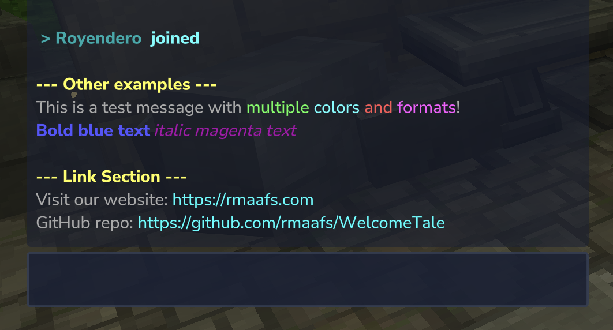
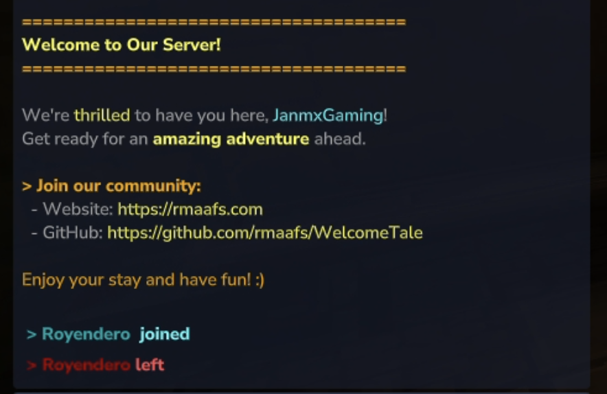

# WelcomeTale

A Hytale server plugin that disables the default join message broadcast and displays custom welcome messages when players join your server.

## 

## 

## 

## Description

WelcomeTale is a plugin for Hytale that enhances the player experience with a comprehensive message system:

- **Server-wide join announcements** when someone joins (customizable join message broadcasted to all players)
- **Private welcome messages** sent directly to the joining player
- **Server-wide leave announcements** when someone leaves (customizable leave message broadcasted to all players)

You can personalize all message formats with colors, multiple lines, and control whether default join messages are displayed.

[GitHub Repository](https://github.com/rmaafs/WelcomeTale)

## Where to Download

You can download WelcomeTale from multiple platforms:

- **[GitHub Releases](https://github.com/rmaafs/WelcomeTale/releases)** - Official releases
- **[CurseForge](https://legacy.curseforge.com/hytale/mods/welcometale)** - Hytale mod repository
- **[ModTale](https://modtale.net/mod/welcometale)** - Community mod platform
- **[Unified Hytale](https://www.unifiedhytale.com/project/welcometale)** - Hytale mod repository

**📢 Want us to publish on another platform?** Let us know which one you'd like to see!

## Features

- 💬 **Triple message system** - Complete control over player connection messages:
  - **Join broadcast** (`JoinMessage`) - Announce to all players when someone joins
  - **Private welcome** (`WelcomePlayerMessage`) - Personal welcome message sent only to the joining player
  - **Leave broadcast** (`LeaveMessage`) - Announce to all players when someone leaves
- 🎨 **Color & formatting support** - Use Minecraft color codes (`&`) for colorful, styled messages
  - 16 color options (black, blue, green, aqua, red, purple, gold, gray, etc.)
  - Text formatting: bold (`&l`), italic (`&o`), reset (`&r`)
- 🔗 **Clickable links** - Automatically detects and converts HTTP/HTTPS URLs into clickable links
  - Links are displayed in cyan color and open in browser when clicked
  - Supports complex URLs with paths, queries, and parameters
- 📝 **Multi-line message support** - Create beautiful message banners with multiple lines
- 👤 **Player name placeholder** - Use `{player}` to dynamically insert the joining player's name
- 🔕 **Optional join message control** - Disable Hytale's default join messages for full control
- 🔄 **Hot-reload configuration** - Update settings without restarting the server using `/welcometale`
- ⚙️ **Easy JSON configuration** - Simple, human-readable configuration file
- 🛡️ **Permission system** - Control who can reload the configuration

---

## For Server Administrators

### Installation

1. Download the latest release from the [Releases](https://github.com/rmaafs/WelcomeTale/releases) page
2. Place the `WelcomeTale-x.x.x.jar` file in your Hytale server's `mods` folder
3. Start your server
4. The plugin will automatically create a folder at `mods/com.rmaafs_WelcomeTale`

### Configuration

#### First Time Setup

When you first run the plugin, it will generate a `config.example.json` file in the `mods/com.rmaafs_WelcomeTale` directory.

**Important:** You must rename `config.example.json` to `config.json` to use your own configuration.

> **⚠️ Upgrading from an older version?** Check the `config.example.json` file inside your server's `mods/com.rmaafs_WelcomeTale` folder to use the new configuration format.

#### Configuration Options

The `config.json` file contains the following options:

```json
{
  "DisableDefaultJoinMessage": true,
  "JoinMessage": ["", "&3&l > &3{player} &b joined", ""],
  "LeaveMessage": ["", "&4&l > &4{player} &cleft", ""],
  "WelcomePlayerMessage": [
    "",
    "&6&l=====================================",
    "&e&lWelcome to Our Server!",
    "&6&l=====================================",
    "",
    "&7We're &ethrilled &7to have you here, &b{player}&7!",
    "&7Get ready for an &e&lamazing adventure &r&7ahead.",
    "",
    "&6&l> &6Join our community:",
    "&7  - Website: &ehttps://rmaafs.com",
    "&7  - GitHub: &ehttps://github.com/rmaafs/WelcomeTale",
    "",
    "&6Enjoy your stay and have fun! :)",
    ""
  ],
  "MessageReloaded": "&aConfiguration reloaded successfully!",
  "NoPermission": "&cYou don't have permission to use this command!"
}
```

**Configuration Fields:**

- `JoinMessage`: **Server-wide broadcast message** sent to all players when someone joins
  - Use `{player}` as a placeholder for the joining player's name
  - Supports color codes with `&` (see Color Codes section below)
  - Set to empty array `[]` to disable server broadcasts
  - Example: `["&3&l > &3{player} &b joined"]`
- `LeaveMessage`: **Server-wide broadcast message** sent to all players when someone leaves
  - Use `{player}` as a placeholder for the leaving player's name
  - Supports color codes with `&` (see Color Codes section below)
  - Set to empty array `[]` to disable leave broadcasts
  - Example: `["&3&l < &3{player} &c left"]`
- `WelcomePlayerMessage`: **Private welcome message** sent only to the joining player

  - Use `{player}` as a placeholder for the joining player's name
  - Perfect for server rules, links, or personalized greetings
  - Set to empty array `[]` to disable private welcome messages
  - Example: `["&7Welcome &a{player} &7to the server!"]`

- `DisableDefaultJoinMessage`: Set to `true` to **disable the default Hytale join message**. This gives you full control over join notifications
- `MessageReloaded`: Message displayed when configuration is successfully reloaded
- `NoPermission`: Message displayed when a player lacks permission to execute the command

#### Color Codes

You can customize your messages with colors using the `&` symbol followed by a color code:

**Color Codes:**

- `&0` - Black
- `&1` - Dark Blue
- `&2` - Dark Green
- `&3` - Dark Aqua
- `&4` - Dark Red
- `&5` - Dark Purple
- `&6` - Gold
- `&7` - Gray
- `&8` - Dark Gray
- `&9` - Blue
- `&a` - Green
- `&b` - Aqua
- `&c` - Red
- `&d` - Light Purple
- `&e` - Yellow
- `&f` - White

**Formatting Codes:**

- `&l` - Bold
- `&o` - Italic
- `&r` - Reset (removes all formatting)

**Example:**

```json
"WelcomePlayerMessage": ["&7Welcome &a&l{player}&r &7to our &b&oawesome&r &7server!"]
```

This will display: "Welcome **{player}** to our _awesome_ server!" with appropriate colors.

#### Multi-Line Messages

You can create multi-line messages by using an array format for both `JoinMessage` and `WelcomePlayerMessage`:

```json
"WelcomePlayerMessage": [
  "&7============================",
  "&a&lWelcome {player}!",
  "&7Thank you for joining",
  "&eHave fun playing!",
  "&7============================"
]
```

Each line will be displayed separately, creating a beautiful message banner.

#### Message Behavior

When a player joins the server:

1. **`JoinMessage`** is broadcasted to all players on the server (if not empty)
2. **`WelcomePlayerMessage`** is sent privately to the joining player (if not empty)

When a player leaves the server:

1. **`LeaveMessage`** is broadcasted to all players on the server (if not empty)

If any message field is an empty array `[]` or contains only whitespace, that message will not be sent

#### Reloading Configuration

After modifying the `config.json` file, you can reload the configuration without restarting the server:

**In-game:** Run the command `/welcometale`

**Console:** Execute `welcometale`

This will reload all configuration changes immediately.

### Commands

| Command        | Description                      | Permission           |
| -------------- | -------------------------------- | -------------------- |
| `/welcometale` | Reloads the plugin configuration | `welcometale.reload` |

**Note:** Only users with the `welcometale.reload` permission can execute this command. By default, server operators have this permission.

---

## For Developers

### Prerequisites

- **Java 25** or higher
- **Maven**
- **Hytale Server JAR**

### Building from Source

1. Clone the repository:

   ```bash
   git clone <repository-url>
   cd WelcomeTale
   ```

2. Create a `.env` file in the project root with your Hytale installation paths:

   ```env
   HYTALE_MODS_DIR=/path/to/hytale/mods
   HYTALE_SERVER_JAR=/path/to/hytale/Server.jar
   ```

   Replace `/path/to/hytale/mods` with the actual path to your Hytale server's mods directory, and `/path/to/hytale/Server.jar` with the path to your Hytale Server JAR file.

3. Build the plugin:

   ```bash
   mvn clean package
   ```

4. The compiled plugin will be in the `target` directory as `WelcomeTale-x.x.x.jar`

5. Copy the JAR to your Hytale server's `mods` folder or use the Maven configuration to auto-deploy

### Project Structure

```
WelcomeTale/
├── LICENSE                          # Project license
├── pom.xml                          # Maven configuration
├── README.md                        # Documentation
├── docs/
│   └── images/                      # Screenshots and images
├── src/main/
│   ├── java/com/rmaafs/welcometale/
│   │   ├── Main.java                    # Plugin entry point
│   │   ├── WelcomeTaleConfig.java       # Configuration class
│   │   ├── commands/
│   │   │   └── WelcomeTaleCommand.java  # Command handler
│   │   ├── listeners/
│   │   │   └── PlayerEvents.java        # Event listeners for join/leave
│   │   └── utils/
│   │       ├── MessageFormatter.java    # Message formatting utility
│   │       └── FileConfiguration.java   # Config file manager
│   └── resources/
│       ├── config.example.json          # Example configuration
│       ├── config.json                  # Active configuration
│       └── manifest.json                # Plugin manifest
└── target/                          # Compiled output (generated)
```

---

## Support & Contributing

This is just the beginning of a great journey in the era of creating plugins for Hytale! I'm open to working on whatever is needed to improve this plugin and help the community.

If you encounter any **bugs** or have **new ideas** for features, please [open an issue](https://github.com/rmaafs/WelcomeTale/issues) on this repository. Your feedback and contributions are highly appreciated as we build together the Hytale modding ecosystem.

---

## 🌟 Show Your Support

If you find this plugin useful, please consider:

- ⭐ **Star this repository** to show your support and help others discover it!
- 👀 **Follow [@rmaafs](https://github.com/rmaafs)** on GitHub to stay updated on future Hytale plugins and projects
- ☕ **Buy me a coffee** on [PayPal](https://paypal.me/royendero) to support continued development

### 🎨 Need a Custom Plugin?

I'm available for **custom plugin development**! If you need a specific plugin tailored to your server's needs or want a private, custom solution, feel free to reach out. Let's bring your ideas to life!

---

## License

This project is provided as-is for use with Hytale servers.
