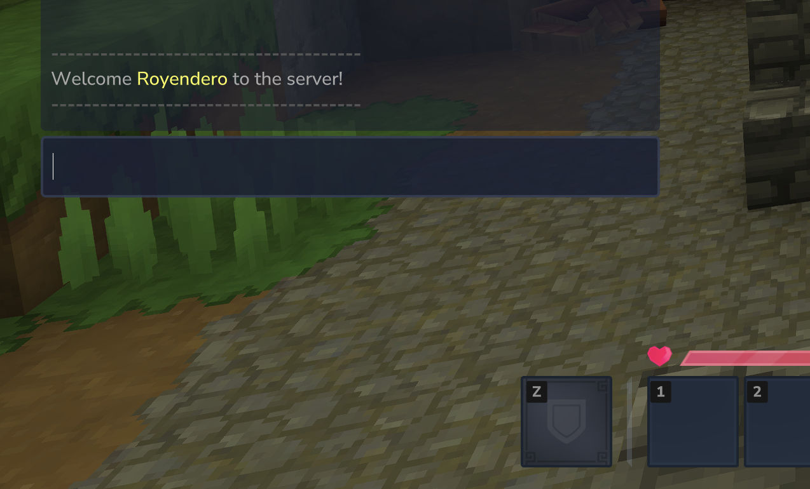

# WelcomeTale

A Hytale server plugin that broadcasts custom welcome messages when players join your server.



## Description

WelcomeTale is a plugin for Hytale that enhances the player experience by sending customizable welcome messages to players when someone joins the server. You can personalize the message format with colors and multiple lines, and control whether default join/quit messages are displayed.

## Features

- Custom welcome messages when players join the server
- Fully configurable message format with player name placeholder
- **Color support using Minecraft color codes with `&` symbol**
- **Multi-line message support**
- **⚠️ Important: Optional disable vanilla join messages** - Take full control of server messages by hiding Hytale's default join notifications
- Hot-reload configuration without restarting the server
- Easy JSON configuration

---

## For Server Administrators

### Installation

1. Download the latest release from the [Releases](../../releases) page
2. Place the `WelcomeTale-x.x.x.jar` file in your Hytale server's `mods` folder
3. Start your server
4. The plugin will automatically create a folder at `mods/com.rmaafs_WelcomeTale`

### Configuration

#### First Time Setup

When you first run the plugin, it will generate a `config.example.json` file in the `mods/com.rmaafs_WelcomeTale` directory.

**Important:** You must rename `config.example.json` to `config.json` to use your own configuration.

#### Configuration Options

The `config.json` file contains the following options:

```json
{
  "Message": ["&7Welcome &a{player} &7to the server!", "&eEnjoy your stay!"],
  "DisableJoinMessage": true,
  "MessageReloaded": "&aConfiguration reloaded successfully!",
  "NoPermission": "&cYou don't have permission to use this command!"
}
```

**Configuration Fields:**

- `Message`: The welcome message sent to players. Can be a single line (string) or multiple lines (array of strings)
  - Use `{player}` as a placeholder for the joining player's name
  - Supports color codes with `&` (see Color Codes section below)
  - Example: `"&7Welcome &a{player} &7to the server!"`
- `DisableJoinMessage`: Set to `true` to **disable the default Hytale join message**. This gives you full control over join notifications
- `MessageReloaded`: Message displayed when configuration is successfully reloaded
- `NoPermission`: Message displayed when a player lacks permission to execute the command

#### Color Codes

You can customize your messages with colors using the `&` symbol followed by a color code:

**Color Codes:**

- `&0` - Black
- `&1` - Dark Blue
- `&2` - Dark Green
- `&3` - Dark Aqua
- `&4` - Dark Red
- `&5` - Dark Purple
- `&6` - Gold
- `&7` - Gray
- `&8` - Dark Gray
- `&9` - Blue
- `&a` - Green
- `&b` - Aqua
- `&c` - Red
- `&d` - Light Purple
- `&e` - Yellow
- `&f` - White

**Formatting Codes:**

- `&l` - Bold
- `&o` - Italic
- `&r` - Reset (removes all formatting)

**Example:**

```json
"Message": "&7Welcome &a&l{player}&r &7to our &b&oawesome&r &7server!"
```

This will display: "Welcome **{player}** to our _awesome_ server!" with appropriate colors.

#### Multi-Line Messages

You can create multi-line welcome messages by using an array format:

```json
"Message": [
  "&7============================",
  "&a&lWelcome {player}!",
  "&7Thank you for joining",
  "&eHave fun playing!",
  "&7============================"
]
```

Each line will be displayed separately, creating a beautiful welcome banner.

#### Reloading Configuration

After modifying the `config.json` file, you can reload the configuration without restarting the server:

**In-game:** Run the command `/welcometale`

**Console:** Execute `welcometale`

This will reload all configuration changes immediately.

### Commands

| Command        | Description                      | Permission           |
| -------------- | -------------------------------- | -------------------- |
| `/welcometale` | Reloads the plugin configuration | `welcometale.reload` |

**Note:** Only users with the `welcometale.reload` permission can execute this command. By default, server operators have this permission.

---

## For Developers

### Prerequisites

- **Java 25** or higher
- **Maven**
- **Hytale Server JAR**

### Building from Source

1. Clone the repository:

   ```bash
   git clone <repository-url>
   cd WelcomeTale
   ```

2. Create a `.env` file in the project root with your Hytale installation paths:

   ```env
   HYTALE_MODS_DIR=/path/to/hytale/mods
   HYTALE_SERVER_JAR=/path/to/hytale/Server.jar
   ```

   Replace `/path/to/hytale/mods` with the actual path to your Hytale server's mods directory, and `/path/to/hytale/Server.jar` with the path to your Hytale Server JAR file.

3. Build the plugin:

   ```bash
   mvn clean package
   ```

4. The compiled plugin will be in the `target` directory as `WelcomeTale-x.x.x.jar`

5. Copy the JAR to your Hytale server's `mods` folder or use the Maven configuration to auto-deploy

### Project Structure

```
WelcomeTale/
├── src/main/java/com/rmaafs/welcometale/
│   ├── Main.java                    # Plugin entry point
│   ├── WelcomeTaleConfig.java       # Configuration class
│   ├── commands/
│   │   └── WelcomeTaleCommand.java  # Command handler
│   ├── listeners/
│   │   └── PlayerEvents.java        # Event listeners
│   └── utils/
│       ├── CustomColors.java        # Color formatting utility
│       └── FileConfiguration.java   # Config file manager
└── src/main/resources/
    ├── config.example.json          # Example configuration
    └── manifest.json                # Plugin manifest
```

---

## Support & Contributing

This is just the beginning of a great journey in the era of creating plugins for Hytale! I'm open to working on whatever is needed to improve this plugin and help the community.

If you encounter any **bugs** or have **new ideas** for features, please [open an issue](../../issues) on this repository. Your feedback and contributions are highly appreciated as we build together the Hytale modding ecosystem.

## License

This project is provided as-is for use with Hytale servers.
